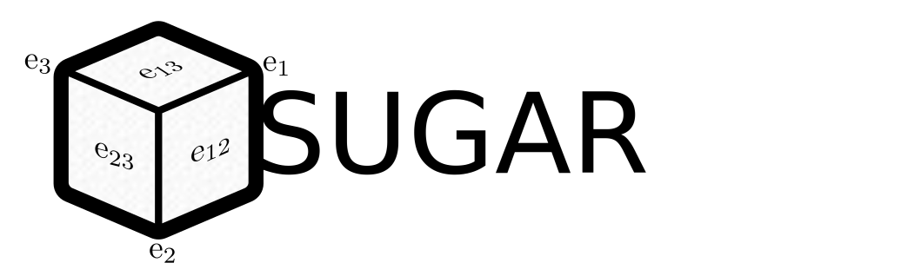
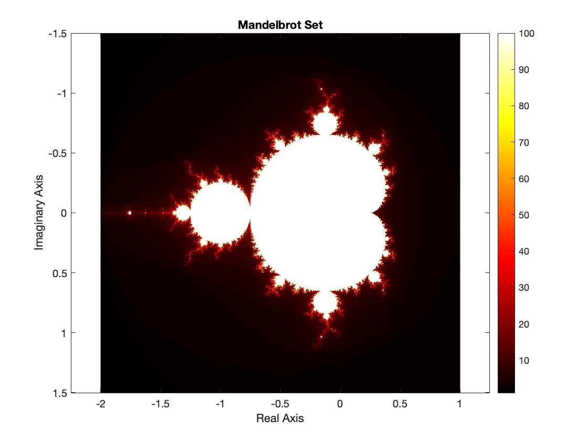
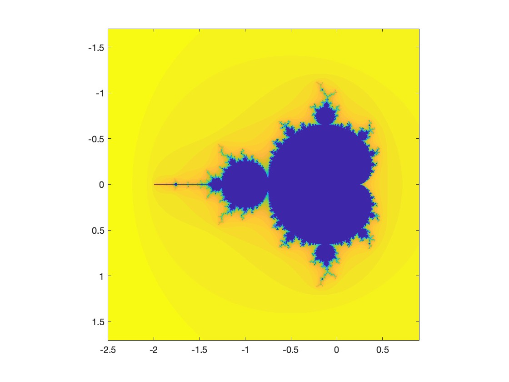
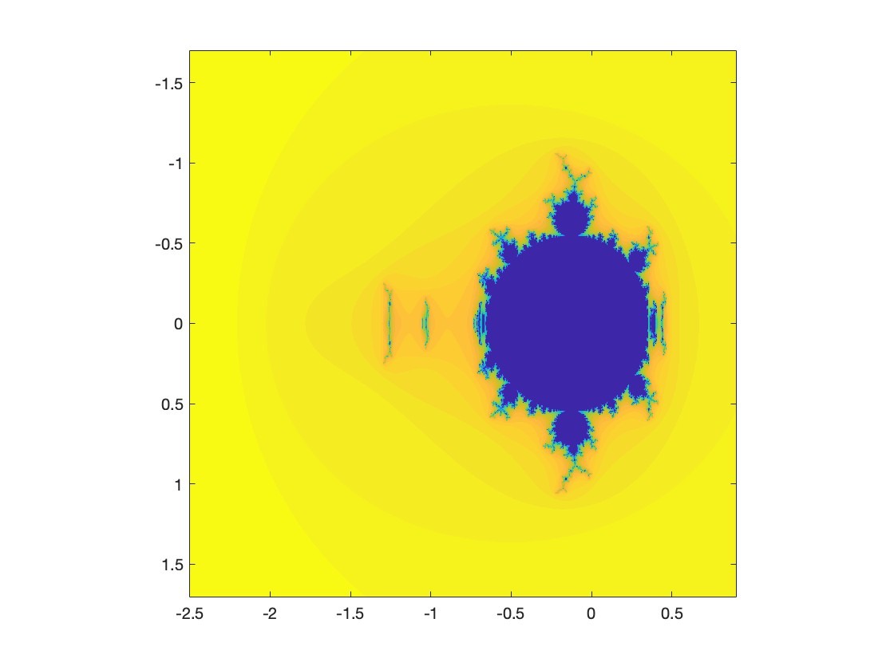
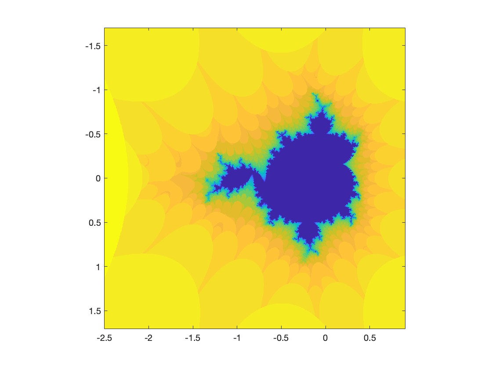

# The Mandelbrot set in GA using SUGAR
## Generating the Mandelbrot Fractal

The Mandelbrot set is a famous fractal defined in the complex plane. It is generated by iterating a simple mathematical equation and analyzing the behavior of the sequence. The set is named after Benoît B. Mandelbrot, who studied and popularized it in the 1970s.

### Definition

The Mandelbrot set is defined for complex numbers, where each complex number is represented as \( c = x + iy \), with \( x \) and \( y \) being real numbers and \( i \) the imaginary unit \( i^2 = -1 \).

To determine if a complex number \( c \) belongs to the Mandelbrot set, we start with the initial value \( z_0 = 0 \), and iteratively compute the sequence using the recursive formula:

\[
z_{n+1} = z_n^2 + c
\]

where \( z_n \) is a complex number at the \( n \)-th iteration.

### Convergence and Divergence

The behavior of the sequence determines whether \( c \) is part of the Mandelbrot set:

- If the sequence remains bounded (i.e., the magnitude \( |z_n| \) does not tend to infinity) for a large number of iterations, then the point \( c \) belongs to the Mandelbrot set.
- If the magnitude \( |z_n| \) exceeds a certain threshold (commonly taken as 2) during the iterations, the point \( c \) is considered to diverge, meaning it does not belong to the Mandelbrot set.

### Visualization

To visualize the Mandelbrot set, we follow these steps:

1. Choose a region of the complex plane (e.g., \( -2 \leq x \leq 2 \), \( -2 \leq y \leq 2 \)).
2. Divide the region into a grid of points, each representing a complex number \( c \).
3. For each point \( c \), iterate the formula \( z_{n+1} = z_n^2 + c \), starting with \( z_0 = 0 \), for a maximum number of iterations \( N \).
4. If the magnitude \( |z_n| \) exceeds 2 before reaching \( N \) iterations, color the point based on the iteration count when divergence was detected. If \( |z_n| \) remains below 2 after \( N \) iterations, color the point as part of the Mandelbrot set (usually black).

The set itself is the boundary separating points that diverge from those that do not.

### Example Matlab Code for Generating the Mandelbrot Set

Here is a MATLAB code snippet to generate the Mandelbrot fractal:

```matlab
% Parameters for the fractal
width = 800;
height = 800;
x_min = -2;
x_max = 1;
y_min = -1.5;
y_max = 1.5;
max_iter = 100;

% Create a grid of complex numbers
x = linspace(x_min, x_max, width);
y = linspace(y_min, y_max, height);
[Re, Im] = meshgrid(x, y);
C = Re + 1i * Im;

% Initialize the Mandelbrot iteration
Z = zeros(size(C));
M = zeros(size(C));

% Iterating the Mandelbrot formula
for n = 1:max_iter
    mask = abs(Z) <= 2;
    Z(mask) = Z(mask).^2 + C(mask);
    M(mask) = M(mask) + 1;
end

% Display the Mandelbrot fractal
imagesc(x, y, M);
colormap(hot);
colorbar;
axis equal;
title('Mandelbrot Set');
xlabel('Real Axis');
ylabel('Imaginary Axis');
````

Which reveals itself as the aclamated image shown below.



## Generating the Mandelbrot Fractal in GA([0,1,0])
### Complex Numbers and Geometric Algebra \(G_{0,1,0}\)

The complex numbers, denoted as \( \mathbb{C} \), form a number system where each number can be represented as \( z = a + bi \), with \( a \) and \( b \) being real numbers, and \( i \) satisfying \( i^2 = -1 \).

**Geometric Algebra \(G_{0,1,0}\)**, also known as the geometric algebra of a 1-dimensional space with a metric of signature \( (0,1,0) \), is a simple algebraic structure where the basis elements satisfy the following properties:

1. **Scalar part**: Represents the real numbers, similar to \(a\) in \(a + bi\).
2. **1-dimensional vector**: Represents the imaginary unit, denoted as \( e_1 \), which squares to \( -1 \) (i.e., \( e_1^2 = -1 \)).

### Isomorphism Explanation

An **isomorphism** is a mapping between two structures that preserves their algebraic properties. The complex numbers \( \mathbb{C} \) and the geometric algebra \( G_{0,1,0} \) are isomorphic because:

- Both structures consist of two components: a scalar and a unit that squares to \(-1\).
- In \( \mathbb{C} \), we have \( a + bi \), where \(i^2 = -1\).
- In \( G_{0,1,0} \), we have a scalar plus a bivector \( e_1 \), where \( e_1^2 = -1 \).

Thus, we can establish an isomorphism by mapping:

\[
z = a + bi \longleftrightarrow a + b e_1
\]

Here, the real part \( a \) in the complex number corresponds to the scalar part in the geometric algebra, and the imaginary part \( b \) corresponds to the coefficient of the vector \( e_1 \).

## The Mandelbrot set using Sugar and GA([0,1,0])
The first step in order to acomplish this end is to generate the required algebra

```matlab
>> GA([0,1,0],'verbose')
Declaring e0 as syntactic sugar, e0=1
Declaring e1 such that e1·e1=-1
 
Declaring G0 for grade slicing as (1)e0  
Declaring G1 for grade slicing as (1)e1  
```
Now, any complex number can be represented with symbolic or numerical parameters, let's use the symbolic ones.
```matlab
>> syms a b real
>> z=a+b*e1

z = 

( a )*e0+( b )*e1
```
we also can declare the offset due to each pixel in the plot
```matlab
>> syms c1 c2 real
>> C=c1+c2*e1

C = 

( c1 )*e0+( c2 )*e1
```

And now we can ask sugar to compute symbolicaly the components of the mandelbrot fractal iteration
```matlab
>> it=z^2+C

it = 

( c1 + a^2 - b^2 )*e0+( c2 + 2*a*b )*e1
```
Which provides us with the algorithm to aply to the iteration. Now, in order to be able to use the components as functions in matlab we first deconstruct the multivector into individual components
```matlab
>> components=it.vector
 
components =
 
[a^2 - b^2 + c1, c2 + 2*a*b]
```
And now we can ask matlab to generate functions from this components (See the documentation of matlabFunction [matlabFunction ](https://es.mathworks.com/help/releases/R2024b/symbolic/sym.matlabfunction.html?overload=sym/matlabFunction)).

```matlab
>>function_iter=matlabFunction(components(1), ...
                             components(2), ...
                             "Outputs",{'z0','z1'})

function_iter =

  function_handle with value:

    @(a,b,c1,c2)deal(c1+a.^2-b.^2,c2+a.*b.*2.0)
```
Which allows us to call it in a iterative way.

A full script to generate the mandelbrot set can be foun below
````matlab
% Mandelbrot plot in GA when p+q+r=1.
% The iterative algorithm for mandelbrot plot is
% z=z^1+b.

n=1000 % number of points per axis
niter=50  % number of iterations to perform 

% Axis limits
y0 = -1.7; y1 = 1.7; step=(y1-y0)/n;
x0=-2.5;x1=0.9;
valsy=y0:step:y1;
valsx=x0:step:x1;

%Selected algebra, in this case complex numbers
GA([0 1 0])

% Simbolic components for the iteration
syms a0 a1 b0 b1 real

% Symbolic MV a and b
a=a0+a1*e1;
b=b0+b1*e1;

% Standar mandelbrot iteration
iteration=a^2+b;
modulus=abs(a);

% Now we have a symbolic multivector with the required operation on each
% component, let's convert it into a matlab function

% Isolated components
mod_vec=modulus.vector;
vector_iter=iteration.vector;

% Make the iterating function itself
function_iter=matlabFunction(vector_iter(1), ...
                             vector_iter(2), ...
                             mod_vec(1),"Outputs",{'z0','z1','mod'});


% Plane coordinates to make the plot
[B0,B1]=meshgrid(valsx,valsy);


% Components of the multivector for each point in the plane
z0 = zeros(size(B0));
z1 = zeros(size(B0));

% Here we save the value of the iteration, did it converge? did it diverge?
% how long did it take to diverge?
k = zeros(size(B0));

for ii = 1:niter
    [z0,z1,mm] = function_iter(z0,z1,B0,B1);
    k(abs(mm)>5 & k==0)=niter - ii;
end

% Make the plot and set the axes
figure
imagesc(valsx,valsy,k);
colormap parula
axis square
````


This scripts produces the mandelbrot set using GA.



## Generating the Mandelbrot Set in Higher-Dimensional Geometric Algebras

The Mandelbrot set is traditionally defined in the complex plane (a 2D space), where each point represents a complex number. The classic algorithm involves iterating the function:

\[ z_{n+1} = z_n^2 + c \]

where \( z \) and \( c \) are complex numbers, and checking whether the sequence remains bounded.

To generalize the Mandelbrot set to higher-dimensional geometric algebras, we extend this concept to use elements of a geometric algebra (GA), which allows for higher-dimensional numbers beyond the 2D complex plane. Here's how the process can be approached:

1. **Choose a Geometric Algebra**:
   Geometric algebras can be defined for various dimensions. For example, the 3D GA \( \mathcal{G}(3,0) \) or the 4D GA \( \mathcal{G}(3,1) \) can be used. These algebras consist of multivectors, which combine scalars, vectors, bivectors, and higher-grade elements.

2. **Define the Iteration Function**:
   The iteration function can be generalized to:

   \[ M_{n+1} = M_n^2 + C \]

   where \( M \) and \( C \) are multivectors in the chosen GA. Here, \( C \) is a fixed multivector that serves as a parameter, and \( M \) is iteratively updated. The multiplication \( M_n^2 \) uses the geometric product, which combines both dot and wedge products of the components.

3. **Bounding Criterion**:
   In the traditional Mandelbrot set, a point is considered to belong to the set if the sequence does not tend to infinity. In higher-dimensional GAs, we check the norm of the multivector after each iteration. If the norm exceeds a certain threshold (e.g., \( ||M_n|| > 2 \)), the sequence is considered to diverge.

4. **Visualizing the Set**:
   Visualization in dimensions higher than 2 can be challenging. Possible approaches include:
   - **Projecting to Lower Dimensions**: Use a projection to map higher-dimensional points to 2D or 3D spaces.
   - **Color Coding**: Use colors to represent different properties, such as the number of iterations before divergence or the norm of the multivector at each iteration.
   - **Cutting Plane** Use a 2D plane that cuts the n-dimensional algebra. It must be specified a point beloonging to the plain in order to fix its position

5. **Algorithm Example**:
   Here is a pseudocode outline for generating the Mandelbrot set in a geometric algebra:

```plaintext
   for each multivector C in the desired space:
       M = 0
       for n = 1 to max_iterations:
           M = M * M + C
           if ||M|| > threshold:
               mark C as diverging
               break
       if C did not diverge:
           mark C as part of the Mandelbrot set
```

This techniques are implemented in the files in this folder named: 
- **mandelbrotG1** The conventional mandelbrot set, but you may chose whenever de imaginary part squares to 1 (hyperbolic numbers), to 0 (dual numbers) or to -1(complex numbers).
- **mandelbrotG2** Performs the computation in algebras where p+q+r=2. This includes the quaternions. You must pass extra parameters to the function in order to fix the position of the cutting plane where you perform the plot.
- **mandelbrotG3** Performs the computation in algebras where p+q+r=3.You must pass extra parameters to the function in order to fix the position of the cutting plane where you perform the plot.


## 1. `mandelbrotGA1`

### Description
The function `mandelbrotGA1` generates a Mandelbrot set plot in Geometric Algebra where \( p + q + r = 1 \). This is equivalent to using complex numbers (2D algebra). The iterative algorithm is based on the classic Mandelbrot iteration:
\[
z = z^2 + b
\]
The function uses symbolic components to calculate the iterations and creates a plot based on whether each point diverges.

### Parameters
- `n`: Resolution of the plot (number of points along each axis).
- `niter`: Number of iterations for the Mandelbrot calculation.

### Example Execution
To generate a conventional Mandelbrot set:
```matlab
mandelbrotGA1(1000, 30)
```

### Result
The resulting plot displays the classic Mandelbrot fractal, using a 2D plane representation.


## 2. `mandelbrotGA2`

### Description
The `mandelbrotGA2` function extends the Mandelbrot set to Geometric Algebra where \( p + q + r = 2 \), using a 4D algebra. The plot is generated on a plane within this 4D space, and the orientation of the plane is determined by two extra parameters.

### Parameters
- `n`: Resolution of the plot.
- `niter`: Number of iterations.
- `p1`, `p2`: Parameters used to specify components of the vector `b` for the iteration.

### Example Execution
To generate a Mandelbrot set equivalent to the conventional plot:
```matlab
mandelbrotGA2(1000,50,0.3,-0.2)
```

### Result
The resulting plot shows the Mandelbrot fractal in a different configuration, allowing for exploration of the effects of the higher-dimensional algebra.



## 3. `mandelbrotGA3`

### Description
The `mandelbrotGA3` function generates a Mandelbrot set plot in Geometric Algebra where \( p + q + r = 3 \). It uses a 4D algebra with more parameters to specify the plotting plane's configuration.

### Parameters
- `n`: Resolution of the plot.
- `niter`: Number of iterations.
- `p1`, `p2`, `p3`, `p4`, `p5`, `p6`: Parameters assigned to various components of the vector `b` in the iteration.

### Example Execution
To generate a plot equivalent to the conventional Mandelbrot set:
```matlab
mandelbrotGA3(1000,30,0.01,0,0.1,0.1,0.1,.1)
```

### Result
The plot provides a more complex visualization, allowing exploration of higher-dimensional Mandelbrot structures.
