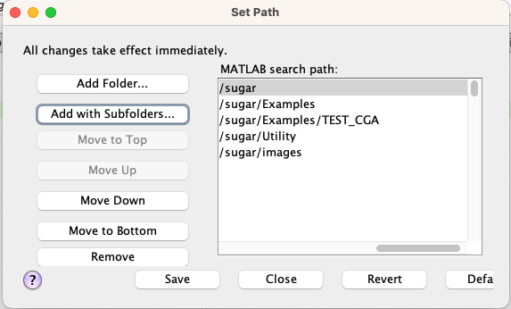

![alt "Image of the workspace after executing the basis([2,0,0]) command"](./images/sugar.svg "Image of the workspace after executing the basis([2,0,0]) command")

# SUGAR
Wellcome to sugar lib, sugar stands for **Symbolic** and **User-friendly** Geometric Algebra Routines. This paper comes with an accompanying paper (doi of the preprint version at arXiv: [2403.16634](https://arxiv.org/abs/2403.16634))

Sugar is an open source engineer-friendly toolbox for Matlab licensed under the MIT License that allows computing with geometric algebras (GAs), and in particular, it supports symbolic computations, and both numeric and symbolic computations are available in high-dimensional GAs. SUGAR is specially targeted to be used in engineering applications. To this end, it has been designed to represent the geometric elements and transformations of the two and three- dimensional projective and conformal geometric algebras in an intuitive way that matches the computations found in the literature. In addition, it handles numerically and symbolically functions of multivectors such as, for instance, the exponential, logarithm, sinus and cosinus functions, among others. These advantages allow the use of SUGAR in different engineering fields such as robotics, control systems, and power electronics.

# Installation Guide

In order to add Sugar to your Matlab distribution please follow these next steps:

1. **Obtaining the Repository:**
   
   You can clone or download the Sugar repository to a location on your computer. This can be done via the command line or directly through GitHub's interface:

   - To clone using the command line, type the following command:
     ```
     $ git clone https://github.com/distributed-control-systems/SUGAR.git
     ```
   - Alternatively, you can download the repo using the dropdown menu from the green "Code" button on GitHub:

     

	 And unzip the downloaded file to anywere in your computer.

2. **Adding Sugar to Matlab:**

   To integrate Sugar into Matlab, add the downloaded folder with its subfolders to your Matlab path:
   
   - Open the Matlab home menu and click on "Set Path":

     

   - In the dialog that appearsselect "Add with Subfolders", navigate to the Sugar folder you just downloaded and click on "Apply".
   	

Congratulations! You have successfully installed Sugar in Matlab. To begin using Sugar and explore its functionalities, proceed with the following sections of this guide.

Please note, this guide does not cover the basics of geometric algebra. For those interested in learning more about geometric algebra, we recommend visiting [The Bivector Website](https://bivector.net), which offers excellent resources for beginners.

# Basic functions

In the following section, we will outline the fundamental operations within the sugar environment.

## GA( [p,q,r] ), declare a set of basis with a given signature
This is useful for shorthand multi-vector creation, if "verbose" option is prvides then you get the info of all the variables created into the matlab workspace, for instance:

	>> GA([1,0,0],"verbose")
	Declaring e0 as syntatic sugar, e0=1
	Declaring e1 such that e1·e1=1
		
	Declaring G0 for grade slicing as (1)e0 
	Declaring G1 for grade slicing as (1)e1

If we want to create a basis for complex numbers

	>> GA([0,1,0],"verbose")
	Declaring e0 as syntatic sugar, e0=1
	Declaring e1 such that e1·e1=-1
	
	Declaring G0 for grade slicing as (1)e0 
	Declaring G1 for grade slicing as (1)e1 

Or, for instance, quaternion-based algebra

	>> GA([0,2,0],"verbose")
	Declaring e0 as syntatic sugar, e0=1
	Declaring e1 such that e1·e1=-1
	Declaring e2 such that e2·e2=-1
	Declaring e12 such that e12·e12=-1
	
	Declaring G0 for grade slicing as (1)e0 
	Declaring G1 for grade slicing as (1)e1+(1)e2 
	Declaring G2 for grade slicing as (1)e12 

Alterntively, you can call it without the "verbose" option, which majes it silent (no text written to the output)

The effects of calling "GA" is a set of new variables declared into the workspace. Try this, clean up all variables and make a call to basis with an specific algebra to check which variables are created

	>> clear all
	>> GA([2,0,0],"verbose")
	Declaring e0 as syntatic sugar, e0=1
	Declaring e1 such that e1·e1=1
	Declaring e2 such that e2·e2=1
	Declaring e12 such that e12·e12=-1
	
	Declaring G0 for grade slicing as (1)e0 
	Declaring G1 for grade slicing as (1)e1+(1)e2 
	Declaring G2 for grade slicing as (1)e12 

Which ends up with a workspace containing thesse variables

![alt "Image of the workspace after executing the basis([2,0,0]) command"](./images/workspace1.png "Image of the workspace after executing the basis([2,0,0]) command")

Which can be used in order to compose vectors or multivectors. Let's inspect the created variables

	>> e1

	e1 = 

	( 1 )e1
	>> e2

	e2 = 

	( 1 )e2
	>> e12

	e12 = 

	( 1 )e12

you can operate thesse variables in different ways

	>> e1*e2

	ans = 

	( 1 )e12
	>> e2*e1

	ans = 

	( -1 )e12
	>> e1+e2

	ans = 

	( 1 )e1+( 1 )e2
	>> e2+e12

	ans = 

	( 1 )e2+( 1 )e12
And the algebra basic properties behave as expected

	>> e1*e1

	ans = 

	( 1 )e0
	>> e2*e2

	ans = 

	( 1 )e0
	>> e12*e12

	ans = 

	( -1 )e0 
Note the *e0* presence in order to indicate that is a multivector with scalar part. The scalar part is allways folowed by a *e0* component, which is just 1.

## Declaring multi-vectors
There are two ways to declare a multi-vector, the first one is to provide the complete set of coefficients of the multi-vector and the signature ([p,q,r]) of the algebra towhich it belongs. 

	>> MV([1 1 2 3],[2,0,0])

	ans = 
	
	 ( 1 )e0+( 1 )e1+( 2 )e2+( 3 )e12
This way of declaring multivectors is usefull in some cases, but it turns out to be dificult for big algebras.	 
The second one is to use a shorthand notation after calling the basis function
	
	>> basis([2,0,0],"verbose")
	Declaring e0 as syntatic sugar, e0=1
	Declaring e1 such that e1·e1=1
	Declaring e2 such that e2·e2=1
	Declaring e12 such that e12·e12=-1
	
	Declaring G0 for grade slicing as (1)e0 
	Declaring G1 for grade slicing as (1)e1+(1)e2 
	Declaring G2 for grade slicing as (1)e12 
	
	>> 1+e1+2*e2+3*e12

	ans = 

	( 1 )e0+( 1 )e1+( 2 )e2+( 3 )e12
which turns out to be the same multi-vector as before.

This multivector can be assigned to a variable into the workspace

	>>A=1+e1+2*e2+3*e12

	A = 

	( 1 )e0+( 1 )e1+( 2 )e2+( 3 )e12

which can be used to perform computations.

Sugar also supports symbolic coefficients in the multivector, which allows you to make generalized computations and to solve some parameter based problems. For instance :

	>>syms x
	>>x*e1
	ans = 	

	 ( x )*e1	

this is the corner stone that grants you the extraordinary abilities you may be searching for.

## Multi-vector properties
The properties associated with a multi-vector are:

* The signature
* The vector coefficients
* The matrix representation (in ortogonal basis vectors)
* The basis related to the multi-vector

Lets show them by example

	>> basis([2,0,0],"verbose")
	Declaring e0 as syntatic sugar, e0=1
	Declaring e1 such that e1·e1=1
	Declaring e2 such that e2·e2=1
	Declaring e12 such that e12·e12=-1
	
	Declaring G0 for grade slicing as (1)e0 
	Declaring G1 for grade slicing as (1)e1+(1)e2 
	Declaring G2 for grade slicing as (1)e12 
	
	>> a=1+e1+e2-e12 %Declare a simple multivector

	a = 

	( 1 )e0+( 1 )e1+( 1 )e2+( -1 )e12
	>> % Retrieve the algebra signature to which it belongs
	>> a.Lsignature

	ans =

		2     0     0

	>> % Vector representation of the coefficients
	>> a.vector

	ans =

		1     1     1    -1

	>> % Matrix representation of the coefficients
	>> a.matrix

	ans =

		 1     1     1     1
		 1     1    -1    -1
		 1     1     1     1
		-1    -1     1     1

	>> a.BasisNames	%Set of basis of the vector's algebra

	ans =

	1×4 cell array

		{["e0"]}    {["e1"]}    {["e2"]}    {["e12"]}

## Slicing, and recovering components of a multi-vector
Sugar allows a natural slicing of the multi-vector, but the indexing is vector-based and decopuled from the name of the basis

	>> syms x y z t real
	>> basis([2,0,0],"verbose")
	Declaring e0 as syntatic sugar, e0=1
	Declaring e1 such that e1·e1=1
	Declaring e2 such that e2·e2=1
	Declaring e12 such that e12·e12=-1
	
	Declaring G0 for grade slicing as (1)e0 
	Declaring G1 for grade slicing as (1)e1+(1)e2 
	Declaring G2 for grade slicing as (1)e12 
	
	>> A=x*e0 + y*e1 + z*e2 + t*e12 % declare a MV with symbolic coefficients 

	A = 

	( x )e0+( y )e1+( z )e2+( t )e12
	>> A(1)
	
	ans =
	
	x
	
	>> A(2)
	
	ans =
	
	y

Its possible to make the slicing (coefficients selection) using standard matlab notation

	>> A(1:2)
	
	ans =
	
	[x, y]
	
	>> A(2:4)
	
	ans =
	
	[y, z, t]

Also, slicing refered to the basis names is possible

	>> A(e1)
	
	ans =
	
	y
	
	>> A(e12)
	
	ans =
	
	t
But we are still working in this feature, as a consecuence you cannot ask for a range

	>> A(e1:e12)
	Operator ':' is not supported for operands of type 'MV'.

Instead use a multi-vector to get this 

	>> A(e1+e2+e12)
	
	ans =
	
	[y, z, t]

In case that you wnat to retrive the multivector instead of the coefficients of the multi-vector you are allowed to use curly brackets

	>> A{1}

	ans = 

	( x )e0
	>> A{2}

	ans = 

	( y )e1
	>> A{1:2}

	ans = 

	( x )e0+( y )e1
	>> A{2:4}

	ans = 

	( y )e1+( z )e2+( t )e12
	>> A{e1}

	ans = 

	( y )e1
	>> A{e2}

	ans = 

	( z )e2
	>> A{e1+e2}

	ans = 

	( y )e1+( z )e2

This nice feature allows you to retrive any grade from a multi-vector, because *Sugar* declared the variables G... into the workspace, if you remember 

	>> basis([2,0,0],"verbose")
	Declaring e0 as syntatic sugar, e0=1
	Declaring e1 such that e1·e1=1
	Declaring e2 such that e2·e2=1
	Declaring e12 such that e12·e12=-1
	
	Declaring G0 for grade slicing as (1)e0 
	Declaring G1 for grade slicing as (1)e1+(1)e2 
	Declaring G2 for grade slicing as (1)e12 

So when retiving  garde coefficients you can operate with both methods

	>> A(G1)
	
	ans =
	
	[y, z]
	
	>> A{G1}

	ans = 

	( y )e1+( z )e2

In any case there is a multi-vector method to retrive a grade, namely

	>> A.grade(1)

	ans = 

	( y )e1+( z )e2

## Basic multi-vector operations

### Table of operators
| Name | Ascii | operator |
|:----------|:----------:|:----------:|
| Addition of A and B||A+B|
| Substrac B from A||A-B|
| Geometric product of A and B  |    | A*B   |
| Inner Product of A and B  |    | A.*B   |
| Outer Product of A and B  |    | A.^B   |
| Scalar power of A to k| | A^k|
| Vee of A and B| dual(A.dual*B.dual) | A&B|
| Dual of A| A.dual or dual(A)| |
| Reverse of A| A.reverse or reverse(A)| ~A|
| Conjugate of A| A.conjugate or conjugate(A)|A'|
| Inverse of A| inv(A)|A^-1|


### Learn by example basic operations
Plus and Minus operations are allowed among multi-vectors

	>> basis([1,1,0],"verbose")
	Declaring e0 as syntatic sugar, e0=1
	Declaring e1 such that e1·e1=1
	Declaring e2 such that e2·e2=-1
	Declaring e12 such that e12·e12=1
	
	Declaring G0 for grade slicing as (1)e0 
	Declaring G1 for grade slicing as (1)e1+(1)e2 
	Declaring G2 for grade slicing as (1)e12 
	>> A=1+e1+e2+e12
	
	A = 
	
	 ( 1 )e0 ( 1 )e1 ( 1 )e2 ( 1 )e12
	>> B=-3*e12
	
	B = 
	
	 ( -3 )e12
	>> A+B
	
	ans = 
	
	 ( 1 )e0 ( 1 )e1 ( 1 )e2 ( -2 )e12
	>> A-B
	
	ans = 
	
	 ( 1 )e0 ( 1 )e1 ( 1 )e2 ( 4 )e12


The most important operation over multi-vectors is the geometric product denoted by "*"

We can check that CL[0,1,0] is really the complex number system making a geometric product

	>> basis([0,1,0],"verbose")
	Declaring e0 as syntatic sugar, e0=1
	Declaring e1 such that e1·e1=-1
	
	Declaring G0 for grade slicing as (1)e0 
	Declaring G1 for grade slicing as (1)e1 
	
	>> C1=1+2*e1;
	>> C2=5-1*e1;
	>> C1*C2
	
	ans = 
	
	 ( 7 )*e0+( 9 )*e1
	>> 
Doing the same operation in complex notation

	>> C1=1+2*1i;	
	>> C2=5-1*1i;
	>> C1*C2
	
	ans =
	
	       7        +    9i      
Due to the fact that symbolic coefficients are supported is easy to retrieve the expression of the geometric product in this algebra, going back to the example on complex numbers:
	
	>>syms a b c d real
	>>basis([0,1,0])
	Declaring e0 as syntactic sugar, e0=1
	Declaring e1 such that e1·e1=-1
	
	>>C1=e0*a+e1*b 

	C1 = 
	
	 ( a )*e0 ( b )*e1
	>> C2=e0*c+e1*d

	C2 = 
	
	 ( c )*e0 ( d )*e1
	>> C3=C1*C2
	
	C3 = 
	
	 ( a*c - b*d )*e0 ( a*d + b*c )*e1
	>> equations_of_product=C3([1,2])'
	
	equations_of_product =
	
	a*c - b*d
	a*d + b*c

The specific operations of inner (scalar) and outer (wedge) products may be done using the overloaded operators ".*" and ".^" (there is a dot in front of them, take care). Next example over quaternions may clarify it.

First we create a quaternion's algebra

	>> basis([0 2 0])
	Declaring e0 as syntatic sugar, e0=1
	Declaring e1 such that e1·e1=-1
	Declaring e2 such that e2·e2=-1
	Declaring e12 such that e12·e12=-1

Now two unitary quaternions

	>> A=sym(1/5)+sym(2/5)*e1+sym(2/5)*e2+sym(4/5)*e12

	A = 

	( 1/5 )e0+( 2/5 )e1+( 2/5 )e2+( 4/5 )e12
	>> B=sym(1/2)-sym(1/2)*e1+sym(1/2)*e2+sym(1/2)*e12

	B = 

	( 1/2 )e0+( -1/2 )e1+( 1/2 )e2+( 1/2 )e12


The inner product may be computed as

	>> A.*B

	ans = 

	( -3/10 )e0+( -1/10 )e1+( -3/10 )e2+( 1/2 )e12

The outer product

	>> A.^B

	ans = 

	( 1/10 )e0+( 1/10 )e1+( 3/10 )e2+( 9/10 )e12


I recomend you to compare results from the [Ganja.js cheasheet](https://observablehq.com/@enkimute/ganja-js-cheat-sheets) and those from shugar. The diference is that here you can use symbolic cofficients.


There is no general division ("/") operator, due to de fact that the "/" does not define the precedence of the operands. Whenever you need to perform divisions you should first retrieve the inverse of the divisor, and then, perform a standard geometric product. 


## Powers of multi-vectors to integer numbers

There are many ways in sugar to perform this operation (look into the section "functions of multi-vectors") , but the operator ^ is overloaded to perform powers of multi-vectors. Remember a^b performs $a^b$, is not a shorthand to exterior product. The nice thing is that it is easy to find multi-vector inverses. 

	>> basis([1,1,0])
	Declaring e0 as syntactic sugar, e0=1
	Declaring e1 such that e1·e1=1
	Declaring e2 such that e2·e2=-1
	Declaring e12 such that e12·e12=1
		 
	>> x=1+2*e1+3*e12
	
	x = 
	
	 ( 1 )e0+( 2 )e1+( 3 )e12
	
	>> x_inv=x^-1
	
	x_inv = 
	
	 ( -1/12 )*e0+( 1/6 )*e1+( 1/4 )*e12
	>> x*x_inv
	
	ans = 
	
	 ( 1 )*e0
	>> x_inv*x
	
	ans = 
	
	 ( 1 )*e0 

But, as you should know, you may encounter multi vectors that don't have inverse, for instance:

	>> basis([1,0,1])
	Declaring e0 as syntactic sugar, e0=1
	Declaring e1 such that e1·e1=1
	Declaring e2 such that e2·e2=0
	Declaring e12 such that e12·e12=0
	>> x=1+2*e1+3*e12. %This one works as expected
	
	x = 
	
	 ( 1 )e0 ( 2 )e1 ( 3 )e12
	>> x_inv=x^-1
	
	x_inv = 
	
	 ( -1/3 )*e0 ( 2/3 )*e1 ( 1 )*e12
	
	>> x=3*e2 % This one fails in this algebra
	
	x = 
	
	 ( 3 )e2
	>> x_inv=x^-1
	
	x_inv = 
	
	 ( Inf )*e0

There are other cases where this situation may reproduce. Specially on algebras or multi vectors with negative basis.

## Functions of multi-vectors

SUGAR provides a **comprehensive set of mathematical functions** for **multivectors (MV)**, supporting both **numeric and symbolic** computations. This enables users to apply familiar **trigonometric, exponential, logarithmic, and other mathematical operations** directly to multivectors, making complex algebraic manipulations straightforward.

---

### **Basic Functions for Multivectors**

SUGAR supports the following fundamental functions for **multivectors**:

- **Trigonometric Functions**: `sin`, `cos`, `tan`, `cot`, `sec`, `csc`
- **Hyperbolic Functions**: `sinh`, `cosh`, `tanh`, `coth`, `sech`, `csch`
- **Exponential and Logarithmic Functions**: `exp`, `log`
- **Power Functions**: `sqrt`, `^` (power operator)

Each of these functions is **fully overloaded** to operate on **multivectors** just as they would on standard MATLAB scalars or vectors.

---

### **Applying Functions to Multivectors**

#### **Direct Function Calls**
Many mathematical functions can be **directly applied** to multivectors:

```matlab
GA([2,0,0]); % Define a geometric algebra
A = e1 + e2; % Declare a simple multivector
B = sin(A);   % Compute the sine of A
C = exp(A);   % Compute the exponential of A
```

These functions are **symbolically evaluated** whenever possible, but they can also be computed numerically when the multivector has numeric coefficients.

---

#### **Custom Function Application: `apply()` Method**
For **more advanced function definitions**, SUGAR allows users to **apply custom functions** to each element of a multivector using the `apply()` method:

```matlab
syms x;
GA([0,1,0]); % Define complex numbers algebra
A = e1 * x;
B = A.apply(@(x) exp(x));
```

**Output:**
```
( cos(x) )e0 + ( sin(x) )e1
```

This is particularly useful when working with **symbolic calculations**.

Using double lambda functions we can declare our own functions on multi-vectors, take care to avoid shading standard Matlab functions. For instance:

	>> syms a b x y real
	>> basis([0,1,0])
	Declaring e0 as syntactic sugar, e0=1
	Declaring e1 such that e1·e1=-1
	>> expMV=@(y)y.apply(@(x)exp(x))
	
	expMV =
	
	  function_handle with value:
	
	    @(y)y.apply(@(x)exp(x))
	
	
	>> expMV(2*e1)
	
	ans = 
	
	 ( cos(2) )*e0 ( sin(2) )*e1

Symbolic coefficients are also allowed

	>> syms a b x y w t real
	>> expMV=@(y)y.apply(@(x)exp(x))
	
	expMV =
	
	  function_handle with value:
	
	    @(y)y.apply(@(x)exp(x))
	
	>> expMV(e1*w*t)
	
	ans = 
	
	 ( cos(t*w) )*e0 ( sin(t*w) )*e1

This is in general supported on any multi-vector with real or symbolic coefficients (but uses to be **slow**)

## Matrices of multi-vectors
Sugar allows you to create matrices where the components are multi-vectors (Do no use mixed components).

For instance:

	>> basis([1,1,0])
	Declaring e0 as syntactic sugar, e0=1
	Declaring e1 such that e1·e1=1
	Declaring e2 such that e2·e2=-1
	Declaring e12 such that e12·e12=1
	>> M=[e1 e1+e2; e2 e2-e1]
	
	M = 
	
	 (1)e1     (1)e1 (1)e2    
	 (1)e2     (-1)e1 (1)e2   

And then, (matrix) multiplication

	>>M*M
	
	ans = 
	
	 (1)*e12     (-1)*e0 (3)*e12    
	 (-1)*e0 (-2)*e12     (-1)*e0 (-1)*e12  
And, in some cases, matrix inversion

	>> M2=M^-1
	
	M2 = 
	
	 (1/2)*e1 (1/2)*e2     (1/2)*e1 (-1/2)*e2    
	 (-1/2)*e2     (-1/2)*e1    
	>> M2*M
	
	ans = 
	
	 (1)*e0     0     
	 0      (1)*e0    
	>> M*M2
	
	ans = 
	
	 (1)*e0     0     
	 0      (1)*e0    

We still miss the operation of matrix functions over matrices of multi-vectors... 
# Other functions

## Latex(multi-vector)
 
 In order to allow expresing a multi-vector in scientific documentation we provide a latex() finction that translates a matrix of multi-vectors or a multi-vector to latex notation.
 
 The usage is evident in next snippet
 
	 >> basis([1,1,0])
	Declaring e0 as syntatic sugar, e0=1
	Declaring e1 such that e1·e1=1
	Declaring e2 such that e2·e2=-1
	Declaring e12 such that e12·e12=1
	>> M=[e1 e1+e2; e2 e2-e1]
	
	M = 
	
	 (1)e1     (1)e1 (1)e2    
	 (1)e2     (-1)e1 (1)e2    
	>> latex(M)
	
	
	ans = 
	
	    "\left[\begin{array}{cc}\left(1\right)e_{1}  &  \left(1\right)e_{1}+\left(1\right)e_{2}  \\ \left(1\right)e_{2}  &  \left(-1\right)e_{1}+\left(1\right)e_{2}  \\ \end{array}\right]"


which should be interpreted by a latex engine as 

$\left[\begin{array}{cc}\left(1\right)e_{1}  &  \left(1\right)e_{1}+\left(1\right)e_{2}  \\ \left(1\right)e_{2}  &  \left(-1\right)e_{1}+\left(1\right)e_{2}  \\ \end{array}\right]$

This feature also works for symbolic coefficients

	>> syms a b c d
	>> basis([1,1,0])
	Declaring e0 as syntatic sugar, e0=1
	Declaring e1 such that e1·e1=1
	Declaring e2 such that e2·e2=-1
	Declaring e12 such that e12·e12=1
	>> M=[e1*a e1+e2*(b+c); e2*c e2-e1*a]
	
	M = 
	
	 (a)*e1     (1)*e1 (b + c)*e2    
	 (c)*e2     (-a)*e1 (1)*e2    
	>> latex(M)
	
	ans = 
	
	    "\left[\begin{array}{cc}\left(a\right)e_{1}  &  \left(1\right)e_{1}+\left(b+c\right)e_{2}  \\ \left(c\right)e_{2}  &  \left(-a\right)e_{1}+\left(1\right)e_{2}  \\ \end{array}\right]"

which should be interpreted by a latex engine as 

$$\left[\begin{array}{cc}\left(a\right)e_{1}  &  \left(1\right)e_{1}+\left(b+c\right)e_{2}  \\ \left(c\right)e_{2}  &  \left(-a\right)e_{1}+\left(1\right)e_{2}  \\ \end{array}\right]$$

